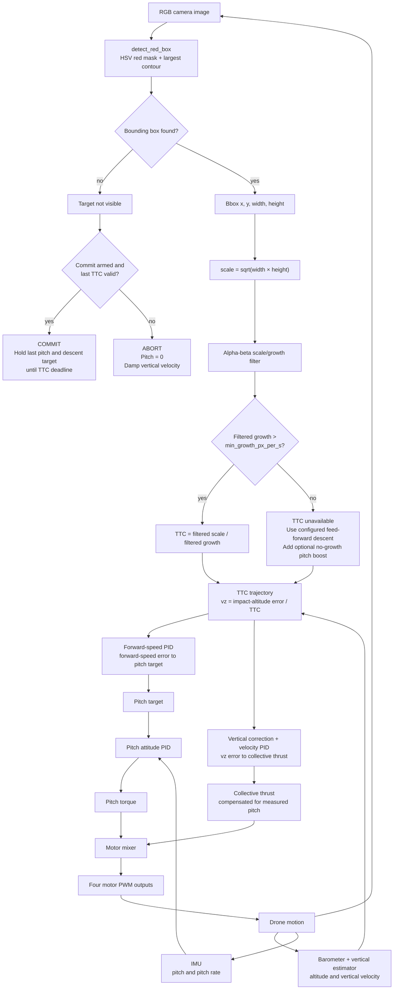
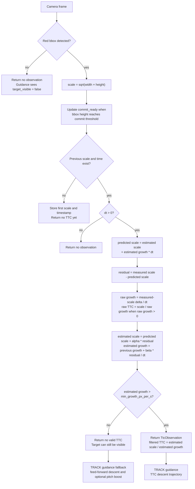

# Image-to-control method flow

This diagram shows one control cycle from an incoming camera image to motor
outputs. The camera runs at its configured frame rate; guidance and physics run
at their own control rates using the latest available visual observation.

## Decision rules

| Observation condition | Pitch and altitude action |
| --- | --- |
| Visible bbox and valid TTC growth | Track configured forward speed; descend to impact altitude over the estimated TTC. |
| Visible bbox but flat/shrinking/invalid TTC growth | Keep tracking; use the TTC-unavailable descent feed-forward and optional pitch boost. Do not fabricate a TTC. |
| Bbox absent after commit is armed with a valid final TTC | Hold the last valid pitch and corrected descent target until the commit deadline. |
| Bbox absent without a safe final TTC | Remove forward pitch and damp vertical velocity in abort. |

The motor mixer combines collective thrust with the pitch-torque correction.
The simulator applies those forces to the vehicle; a field adapter would send
the equivalent motor commands to the flight controller.

## TTC estimator flow

`BboxTtcTracker` runs only when a camera frame is available. This diagram
follows the exact decision path used to produce a `TtcObservation`.

The tracker retains the most recent valid observation separately. It is used
only for the bounded `COMMIT` path after the target leaves the camera view; a
flat or shrinking bbox never creates a synthetic TTC.
