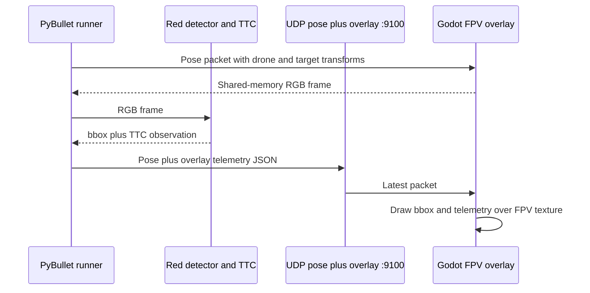

# Godot FPV telemetry overlay

Replace the Godot-run OpenCV preview with a telemetry and red-target overlay
drawn directly over Godot's FPV texture. Python remains responsible for reading
the shared-memory RGB frame, detecting the red target, estimating TTC, and
running PyBullet guidance. Godot remains a renderer and receives the latest
overlay values alongside the existing pose packet on UDP `127.0.0.1:9100`.

The `overlay` payload uses source-frame pixel coordinates (`640 × 360`) for the
bbox. Godot scales those coordinates to the displayed FPV preview. A reset
packet sends a null bbox and cleared values.

```json
{"drone":{"p":[x,y,z],"q":[x,y,z,w]},"target":{"p":[x,y,z],"q":[x,y,z,w]},"overlay":{"bbox":[x,y,width,height],"phase":"track","pitch_deg":12.5,"thrust_n":4.2,"bbox_scale_px":86.0,"bbox_growth_px_s":31.4,"ttc_s":2.7,"command_vx_mps":5.0,"command_vz_mps":-1.5}}
```



The optional saved CSV and PNG telemetry outputs remain unchanged. The
Matplotlib live plot remains available with `--show-plots`; only the OpenCV
window is removed.
