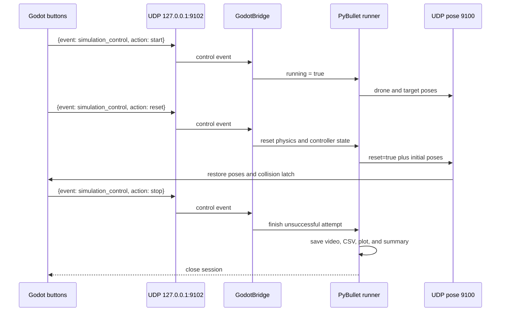

# Godot interactive controls

Move Start/Reset/Stop ownership from the Matplotlib telemetry figure into the
Godot overlay. Godot shows compact `▶`, `↻`, and `■` buttons in the lower-left
corner and sends validated localhost UDP commands to Python on port 9102.

The `--interactive` runner waits for `start`, pauses on `reset`, and keeps the
session alive for another attempt. `stop` finalizes the current attempt as an
operator failure, saves its artifacts, and ends the Python session. Godot does
not own simulation state; it only emits UI commands and receives reset poses.

Validation: test control-message parsing and state transitions, load the Godot
scene headlessly, then manually confirm Start advances and Reset restores both
rendered poses and Python telemetry.
