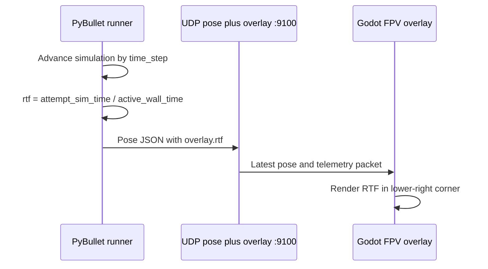

# Godot real-time factor overlay

Display the simulation's real-time factor (RTF) in the lower-right corner of
the Godot window. RTF is the ratio of simulated time advanced to wall-clock
time elapsed:

```text
RTF = simulated seconds / wall-clock seconds
```

An RTF of `1.00x` runs at real-time speed, `2.00x` runs twice as fast, and
`0.50x` runs at half speed. Python calculates the value and sends it in the
existing pose/overlay packet; Godot only renders it. The counters span the
active attempt: the timer starts when Start is pressed and resets when Reset is
pressed. Waiting before Start therefore does not dilute the performance value.

Godot runs use deadline-based pacing: the runner sleeps only for the remainder
of the current physics period after computation. It does not add a full
`time_step` sleep after every frame, so camera and detection work do not
multiply the wall-clock cost.
The pacing tail uses a short spin wait after sleeping because Linux scheduler
granularity can otherwise overshoot a 4.17 ms physics period enough to lower
RTF.

The lower-right display also shows elapsed active wall-clock running time below
RTF so the factor can be interpreted against the current attempt duration. The
displayed factor starts after the first physics tick, avoiding setup-time
startup cost in the performance value.


