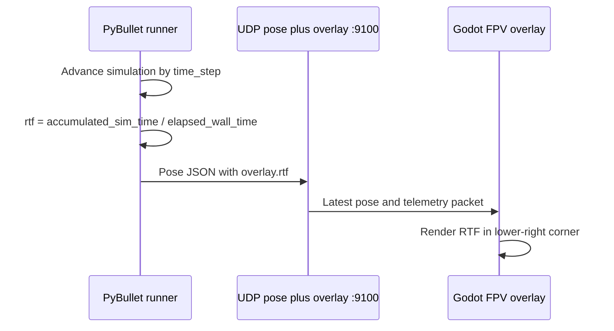

# Godot real-time factor overlay

Display the simulation's real-time factor (RTF) in the lower-right corner of
the Godot window. RTF is the ratio of simulated time advanced to wall-clock
time elapsed:

```text
RTF = simulated seconds / wall-clock seconds
```

An RTF of `1.00x` runs at real-time speed, `2.00x` runs twice as fast, and
`0.50x` runs at half speed. Python calculates the value and sends it in the
existing pose/overlay packet; Godot only renders it. The counters span the
whole session, so interactive waiting and reset pauses lower the throughput
measurement.


