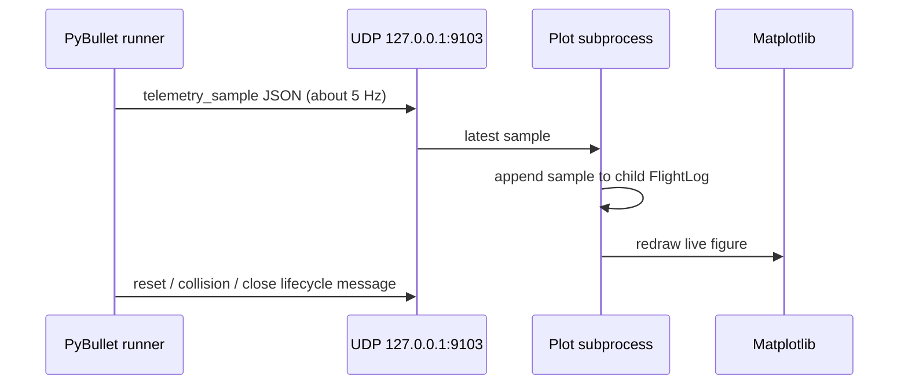

# Separate live plot process

Keep Matplotlib out of the PyBullet physics loop. When live plotting is
enabled, the runner sends compact telemetry samples over best-effort UDP on
`127.0.0.1:9103`; a child process owns the Matplotlib figure and redraws it.
The physics process remains authoritative for `FlightLog`, CSV, and final PNG
output. Dropping a display sample is harmless because the saved telemetry is
complete.

Plotting is display-only: a missing or slow child never blocks physics, and
closing the plot does not stop the simulation. Final CSV/PNG generation stays
in the parent process after the run.

The live plot is opt-in (`--show-plots` or interactive mode). It refreshes at
about 3 Hz, coalesces queued telemetry to the newest sample, renders a bounded
recent history, and caches phase/collision artists. The parent retains the
complete log, so display throttling never removes data from final artifacts.

The grouped simulation configuration is passed through Python's spawn pickle
boundary; its compatibility attribute lookup must tolerate fields being
restored after object construction.
