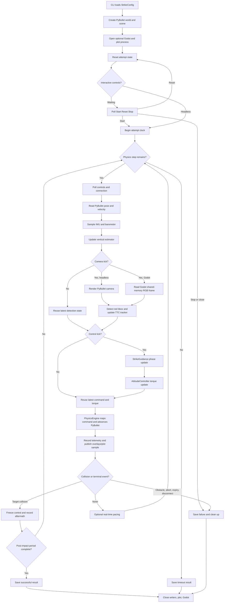
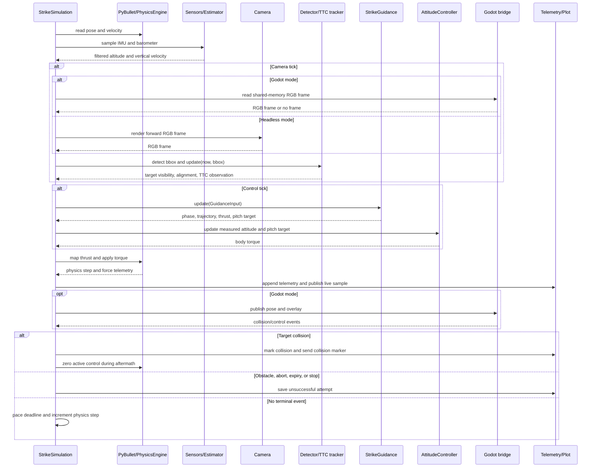

# Fly Smart simulation main loop

`StrikeSimulation.run()` is the orchestration loop for one or more TTC strike
attempts. It keeps the reusable flight core independent from the simulation
adapters: PyBullet advances the vehicle, the core estimates and guides flight,
and optional Godot/plot processes provide rendering and observation sinks.

## Responsibilities

| Module | Responsibility |
| --- | --- |
| `simulation.runner.StrikeSimulation` | Own initialization, clocks, attempt lifecycle, and terminal handling. |
| PyBullet and `PhysicsEngine` | Advance the drone and scene one physics timestep. |
| `simulation.sensors` and `VerticalEstimator` | Produce filtered altitude and vertical velocity from synthetic IMU/barometer data. |
| Camera and `detect_red_box` | Produce an RGB frame and red-target bounding box. |
| `BboxTtcTracker` | Convert bbox scale growth into raw and filtered TTC observations. |
| `StrikeGuidance` | Select the flight phase and high-level trajectory/thrust/pitch command. |
| `AttitudeController` | Convert desired pitch into body torque. |
| Godot bridge | Exchange poses, overlays, frames, collision events, and operator controls. |
| Telemetry and plot process | Record artifacts and optionally render live UDP-fed plots. |

The reusable core (`guidance`, `trajectory`, `sensing`, `ttc`, and target
tracking) does not call PyBullet or Godot. The runner supplies observations and
consumes commands at the simulation seam.

## Clock domains

The default drone profile advances the loop at 240 Hz and updates guidance at
120 Hz. The camera/detector runs at 30 Hz, so the latest detection is reused
between camera samples. The optional plot process refreshes at 3 Hz and is not
on the physics critical path.

One iteration advances simulated time by `1 / physics_hz`. Real-time pacing is
enabled for GUI or Godot runs. The reported real-time factor is:

```text
RTF = simulated elapsed seconds / wall-clock running seconds
```

## Control flow



## Normal tick and event flow

The runner is the only component that coordinates the full cycle. Godot is
optional: without it, the runner renders a PyBullet camera directly and checks
PyBullet contacts; with it, Godot supplies the camera frame and collision
events while PyBullet remains the physics authority.



## Flight phases and termination

- **TAKEOFF** holds zero pitch while the altitude controller climbs and waits
  for a stable barometer estimate. The first fresh tracking observation resets
  the TTC tracker before entering `TRACK`.
- **TRACK** uses live detections. Invalid or long TTC keeps the guidance in its
  pre-TTC descent mode; a valid TTC enables terminal trajectory control.
- **COMMIT** begins after target loss only when the tracker has a commit-ready
  observation. It holds the last valid pitch/descent target until contact or
  the commit deadline.
- **ABORT** stops forward guidance when the target is lost before commit or a
  terminal condition cannot be trusted.
- A target collision records impact speed and runs passive post-impact
  recording. Obstacle collision, operator Stop, timeout, disconnect, and
  commit expiry save unsuccessful artifacts. Interactive Reset starts a fresh
  attempt without recreating the process.

## Data ownership

The runner owns mutable attempt state. Core modules receive immutable input
records and return command/observation records. Telemetry is appended after
each physics step, while the plot process receives only the newest serialized
sample over UDP so plotting cannot block physics. Godot receives poses and
overlays over UDP, reads camera pixels through shared memory, and sends control
and collision events over separate UDP sockets.
