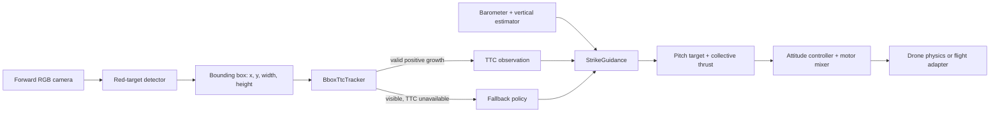

# How Fly Smart turns a bounding box into flight commands

Fly Smart is a diagonal-strike flight stack. It does not need the target's
world position, physical size, image centre, focal length, or a range sensor.
It uses the apparent growth of a detected target to estimate **time to
contact** (TTC), then uses the barometer to make the drone reach the configured
impact altitude at that time.

For the per-cycle decision and control-output diagram, see
[Image-to-control method flow](control-method-flow.md).



## 1. Camera frame to bounding box

At the configured camera rate, `detect_red_box` converts the RGB frame to HSV,
selects red pixels, removes small noise with a 3 x 3 morphological opening,
and returns the largest contour with area of at least 80 pixels. The result is:

```text
(x_px, y_px, width_px, height_px)
```

The detector establishes that the target is visible. It does not estimate range
or command the motors.

## 2. Bounding-box growth to TTC

`BboxTtcTracker` turns a rectangle into one scale value:

```text
s = sqrt(width_px * height_px)
```

For an approaching target, `s` grows. Between camera frames the tracker
calculates raw growth:

```text
raw_growth = (s_now - s_previous) / dt
```

It then smooths both scale and growth with an alpha-beta filter:

```text
predicted_scale = estimated_scale + estimated_growth * dt
residual = measured_scale - predicted_scale
estimated_scale = predicted_scale + alpha * residual
estimated_growth = estimated_growth + beta * residual / dt
TTC = estimated_scale / estimated_growth
```

TTC is valid only when filtered growth is greater than
`min_growth_px_per_s`. Zero or negative growth means the box is flat or
shrinking, so dividing by it would create an unusable or negative TTC. This can
happen even while the bbox is visible—for example, while the vehicle's early
descent changes the camera geometry.

## 3. TTC and altitude trajectory

In `TRACK`, a valid TTC is the time remaining to reach the known impact
altitude. With barometer altitude `h`, desired impact altitude `h_impact`, and
the protected minimum TTC, the nominal vertical velocity is:

```text
vz_nominal = clamp((h_impact - h) / max(TTC, min_ttc_s),
                   -max_descent_velocity_mps,
                   max_climb_velocity_mps)
```

The guidance layer adds a bounded altitude-position correction before the
vertical-velocity PID converts the resulting velocity error to collective
thrust. It compensates collective thrust for the measured pitch angle so the
drone retains vertical lift while tilted forward.

When TTC is unavailable but the target remains visible, the planner uses the
configured `ttc_unavailable_descent_velocity_mps` feed-forward descent instead
of inventing a TTC. The optional
`ttc_unavailable_pitch_boost_deg` adds pitch after normal forward-speed control
in that same condition. The seven-inch scenario sets this boost to 5 degrees,
allowing a temporary 25-degree command; the default is zero.

## 4. TTC and pitch

TTC controls vertical timing, not pitch directly. The planner always supplies
the configured forward speed. A forward-speed PID compares it with measured
forward velocity and emits a pitch target, limited by `max_pitch_deg` (plus the
explicit TTC-unavailable boost when configured). The attitude controller then
uses measured pitch and pitch rate to create motor torque that reaches that
target.

This separation is deliberate:

- The bbox says **when** to arrive at the impact altitude.
- The barometer says **how far vertically** the drone still has to travel.
- The forward-speed loop says **how much to tilt** to build forward speed.
- The vertical-velocity loop says **how much collective thrust** is needed to
  follow the descent trajectory.

## 5. Flight-state safety behavior

`StrikeGuidance` owns four states:

| State | Behavior |
| --- | --- |
| `TAKEOFF` | Altitude PID climbs to the takeoff altitude with zero pitch. |
| `TRACK` | Live bbox/TTC and barometer data update forward pitch and vertical thrust. |
| `COMMIT` | If the target disappears after a sufficiently large bbox and valid TTC, hold the last pitch and descent target until the TTC deadline. |
| `ABORT` | If the target disappears without a safe final TTC, remove forward pitch and damp vertical velocity. |

The tracker resets at the takeoff-to-track handoff so bbox growth accumulated
during climb cannot be mistaken for approach growth.

## Reading the telemetry

The telemetry CSV and plot distinguish the raw TTC trajectory vertical command
from the corrected vertical-velocity target fed to the PID. The bbox-growth
plot has raw and alpha-beta-filtered growth. TTC becomes noisy near zero growth
because it divides by growth, so inspect the growth plot first when diagnosing
an apparent TTC gap.
