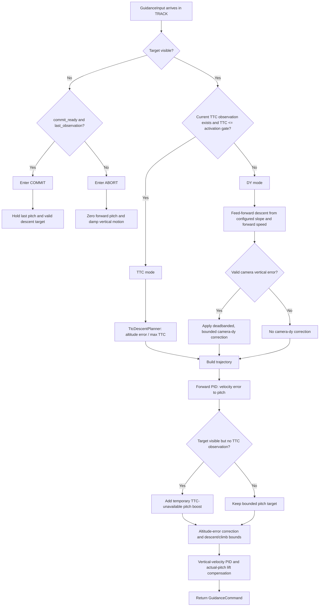

# Tracking-phase flight logic

The `TRACK` phase is the closed-loop portion of the strike mission. Each
control update receives the latest camera/TTC observation, barometer estimate,
forward velocity, measured pitch, and target visibility. `StrikeGuidance` then
produces a trajectory, pitch target, thrust command, and vertical-control mode.

## Decision flow



## Detailed control rules

1. **TTC gate selection**: TTC mode is active only when an observation exists
   and `observation.ttc_s <= ttc_activation_s`. Otherwise the controller uses
   DY mode, even if the target is visible.
2. **TTC mode**: `TtcDescentPlanner` targets the impact altitude and computes
   vertical velocity as altitude error divided by the bounded time-to-go.
3. **DY mode**: the planner starts with the configured unavailable-TTC descent
   and replaces it with the larger of that descent and
   `ttc_unavailable_descent_slope_m_per_m * forward_velocity_mps`.
4. **Camera-dy correction**: only DY mode uses compensated vertical camera
   error. The deadband is removed, the gain is applied, and the result is
   bounded by `camera_dy_max_correction_mps`.
5. **Pitch**: forward-speed PID converts forward-velocity error into pitch,
   then clamps it to `max_pitch_deg`. A visible target with no current TTC
   observation receives the configured temporary pitch boost.
6. **Altitude safety**: altitude-position correction is bounded by
   `max_vertical_position_correction_mps`; the final vertical target is bounded
   by `max_descent_velocity_mps` and `max_climb_velocity_mps`.
7. **Thrust**: vertical-velocity PID corrects measured barometer velocity error.
   Collective force is divided by `max(cos(measured_pitch), 0.5)` so world-
   vertical lift is maintained while the vehicle is tilted.
8. **Valid-TTC memory**: only a valid TTC update stores
   `last_tracking_descent_velocity_mps`, which is the descent target available
   if the target is later lost and COMMIT begins.

## Runtime sequence

```mermaid
sequenceDiagram
    participant R as Simulation runner
    participant V as Camera/TTC tracker
    participant E as Barometer estimator
    participant G as StrikeGuidance
    participant P as TtcDescentPlanner
    participant F as Forward/vertical PID
    participant A as AttitudeController
    participant W as PhysicsEngine

    R->>E: provide IMU/barometer samples
    E-->>R: filtered altitude and vertical velocity
    R->>V: provide latest bbox/detection state
    V-->>R: target_visible, observation, last_observation, commit_ready
    R->>G: update(GuidanceInput)
    G->>G: check target visibility and TTC activation gate
    alt TTC valid
        G->>P: command(ttc_s, altitude_m)
        P-->>G: impact-altitude trajectory
    else TTC invalid or unavailable
        G->>P: command(None, altitude_m)
        P-->>G: pre-TTC trajectory
        G->>G: apply forward-speed descent slope
        G->>G: apply camera-dy correction when visible
    end
    G->>F: update forward and vertical velocity errors
    F-->>G: pitch correction and collective correction
    G->>G: clamp pitch and vertical target
    G->>G: compensate thrust for measured pitch
    G-->>R: GuidanceCommand
    R->>A: update measured attitude and pitch target
    A-->>R: body torque
    R->>W: apply thrust and torque; advance physics

    alt Target lost after commit-ready observation
        R->>G: update(target_visible=false)
        G-->>R: COMMIT command with held pitch/descent target
    else Target lost before commit readiness
        R->>G: update(target_visible=false)
        G-->>R: ABORT command with zero pitch
    end
```

The runner evaluates collision and commit-expiry events after the physics step.
The tracking controller itself does not call PyBullet, render frames, or send
Godot messages; those are simulation-adapter responsibilities.
